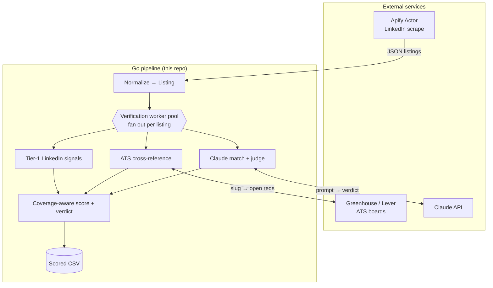

# Job-Search-Go

A concurrent Go tool that finds **legitimate** software-engineering job listings and filters out the ghost jobs. It ingests LinkedIn listings (via Apify), concurrently verifies each one by cross-referencing the employer's own applicant-tracking system and asking Claude to judge the match, and writes a scored CSV.

> **Status:** early development. The module scaffold, core domain model, and CSV output stage are in place. Ingest and verification are in progress — tracked on the "Let's Go!" project board.

## Why

Between a quarter and a third of online job listings are "ghost jobs" — postings with no real intent to hire. Aggregators are incentivized to look busy, so these accumulate. A company's own ATS (Greenhouse, Lever) is the source of truth, so a listing that matches an open requisition there is far more likely to be real. This tool treats **verification as the product**: ingest is just acquisition, and the interesting work is scoring how legitimate each listing actually is.

## Architecture



The boundary is deliberate:
- **Apify** does the scraping on its own cloud — the hostile, anti-bot part — and returns structured JSON. Nothing is scraped locally.
- **Go** owns everything downstream: normalization, the concurrent verification fan-out, scoring, and CSV output. A single `Source` interface (`Fetch(ctx, query) ([]Listing, error)`) abstracts both ingest and ATS lookups.
- **Claude** (via `anthropic-sdk-go`) replaces brittle hand-rolled fuzzy matching with semantic title matching and a legitimacy verdict, returned as structured output.

## How verification works

No single source verifies every employer, so legitimacy is a **coverage-aware score** assembled from whatever signals are available for each listing:
1. **Tier-1 (universal):** signals from the listing itself — repost frequency, applicant count versus posting age, and whether it links to a real ATS apply URL.
2. **ATS cross-reference (strong):** resolve the company to its Greenhouse/Lever board and look for a matching open requisition. A match is the strongest positive signal, and modern startups overwhelmingly use these systems.
3. **Claude judge:** semantic comparison between the listing and candidate ATS requisitions, plus an overall verdict.

Each result records which signals actually ran, so an `uncertain` verdict from thin coverage stays distinct from a genuine `likely-ghost`.

## Build & run

Requires Go 1.26+.

```bash
go build ./...
go test ./...
go run ./cmd/jobsearch
```

Runtime configuration (needed as the ingest and verification stages land):
- `APIFY_TOKEN` — for the LinkedIn ingest Actor
- `ANTHROPIC_API_KEY` — for the Claude verification step

Both are read from the environment; no secrets live in the code.

## Layout

```
cmd/jobsearch/      entry point
internal/model/     core domain types: Listing, Verdict, Source
internal/output/    CSV writer
```

---

A learning project exploring Go concurrency, the Anthropic Go SDK, and ATS-based job verification.
